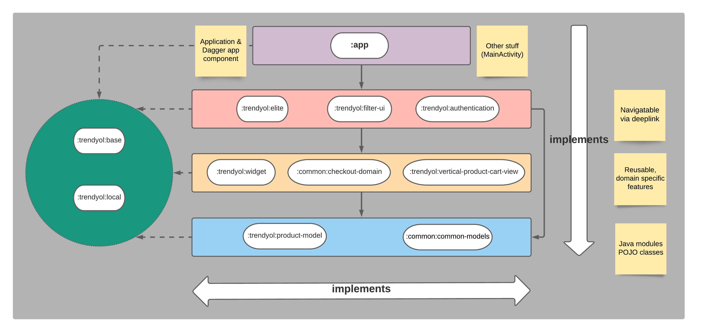

# Module Guideline  
  
## Module Levels  
  
Each module has different content. There are some modules that contain only data classes or only domain or all architectural layers to create a feature.  
  
We decided to create arbitrary concept that is called **module level**. Every time when we mention *level* keyword we refer to our concept not the architectural level. These are similar but different on some points.

There are total 5 levels on our concept:
- Level 0: `:app` module
- Level 1: Navigable via deep link (`:trendyol:authentication`, `:trendyol:elite`, `:trendyol:filter-ui`)
- Level 2: Reusable domain specific features (`:common:widget`, `:common:checkout-domain`, `:trendyol:vertical-product-cart-view`)
- Level 3: POJO classes, not dependent to android (`:common:common-models`, `:trendyol:product-model`)
- Utilities: Can be used on all levels (`common:base`, `:trendyol:remote`)

Lower level modules(eg `:common:common-models`) can be used by higher level modules(eg `:trendyol:authentication`) or in its level if not creating circular dependency.
Level of a module is determined by its highest architectural level. For example `:trendyol:elite` has all 3 layers(ui, domain and data) and it's a level 1 but `:trendyol:filter-ui` has only ui layer but it's also a level 1 module.
Level 2 and level 3 modules should be used across minimum 2 modules; otherwise do not separate as new module, use in higher level module.

This separation helped us to create modularized by providing clear sight about dependency boundaries.
